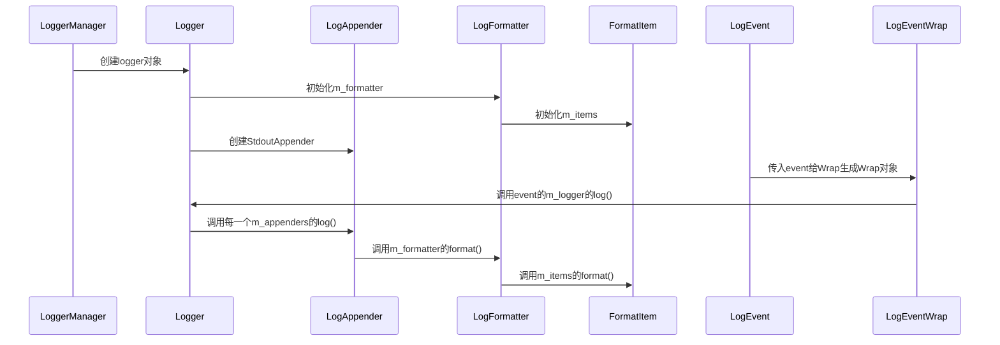
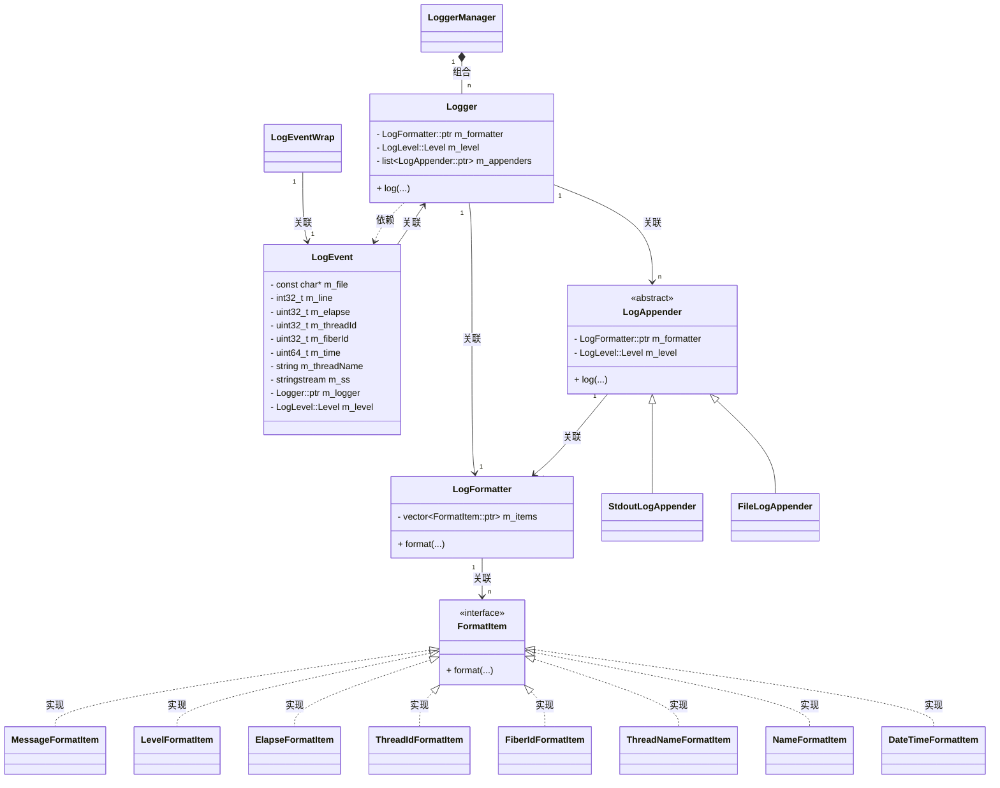
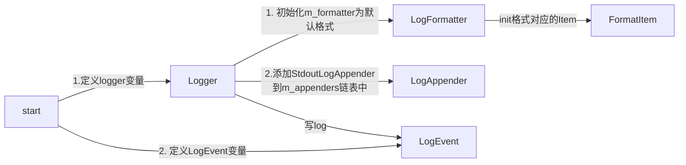

# C++高性能服务器框架

## 项目路径

```shell
├── CMakeLists.txt      // cmake的定义文件 
├── bin                 // 二进制
├── build               // 中间文件路径
├── cmake               // cmake函数文件夹
├── grit                // 源代码路径
│   ├── config_module       // 配置模块
│   └── log_module          // 日志模块
├── lib                 // 库的输出路径
└── tests               // 测试代码
```

## 日志模块

***

### 设计思想

#### 三大组件

*   Logger: 日志记录器, 负责收集处理日志记录 (如何处理日志)&#x20;
*   LogFormatter: 日志格式器, 负责对输出的日志格式化处理 (以什么形式展现日志)&#x20;
*   LogAppender: 日志输出器, 负责日志的输出 (输出到什么地方\[stdout, file])&#x20;

```cpp
    Logger
      |
      |-------LogFormater------FormatItem
      |
  LogAppender
```

### 时序图



### 类图

| Type    | Description       |
| :------ | :---------------- |
| `<\|--` | Inheritance 继承    |
| `*--`   | Composition 组合    |
| `o--`   | Aggregation 聚合    |
| `-->`   | Association 关联    |
| `--`    | Link(Solid) 实线链接  |
| `..>`   | Dependency 依赖     |
| `..\|>` | Realization 实现    |
| `..`    | Link(Dashed) 虚线链接 |



### 流程图



### 核心数据结构

#### LogFormatter

*   LogFormatter, 日志格式处理类, 通过字符串自定义日志的格式(仿printf)， 执行日志格式化，负责日志格式的初始化

```cpp
/** 
 * @brief 将用户自定义的日志格式，解析为对应的FormatItem
 * @details 
 * 日志格式举例：%d{%Y-%m-%d %H:%M:%S}%T%t%T%N%T%F%T[%p]%T[%c]%T%f:%l%T%m%n
 * 格式解析:
 * %d{%Y-%m-%d %H:%M:%S}: %d 时间标识;{%Y-%m-%d %H:%M:%S} 时间格式(可选)DateTimeFormatItem
 * %T: Tab[\t]                                                        TabFormatItem
 * %t: 线程id														  ThreadIdFormatItem
 * %N: 线程名称														  ThreadNameFormatItem
 * %F: 协程id														  FiberIdFormatItem
 * %p: 日志级别														  LevelFormatItem
 * %c: 日志名称														  NameFormatItem
 * %f: 文件名称														  FileNameFormatItem 
 * %l: 行号															  LineFormatItem
 * %m: 日志内容														  MessageFormatItem
 * %n: 换行符[\r\n]        											  NewLineFormatItem
 * 具体格式: 2023-03-20 11:53:30 1234 main 666 [INFO] [system] grit/test_log.c:66 XXX
*/
```

#### LogAppender

*   目前实现抽象类的控制台日志(StdoutLogAppender), 文件日志(FileLogAppender)：拥有自己的LogLevel和LogFormat, 灵活定义不同的输出. 主要为了区分不同日志级别, 例如error级别, 单独输出到文件, 防止被其他日志信息淹没.以后可以通过扩展LogAppender实现向日志服务器写log(socket)

#### Logger

*   Logger, 对外使用的类, 输入的日志级别大于等于Logger的日志才会被真正写入, 可以有不同的Logger, 不同的Logger记录不同类型的日志, 例如系统框架日志和业务逻辑日志。
*   类中包含一个LogFormatter，一个root Logger，N个LogAppender

#### LoggerManager

系统中只需要一个loggerManager去管理所有的logger日志器 ---- 单例

创建logger 交给工厂去做

#### LogEvent

日志事件的封装，将要写的日志，填充到LogEvent中。填充完毕后，写入到对应的Logger里面。

#### LogEventWrap

### C++知识点

#### C++11 智能指针

*   头文件：`<memory>`

##### *shared\_ptr*

#### stringstream


&#x20;&#x20;

### 设计模式

工厂方法模式

单例模式

## 配置模块

***


